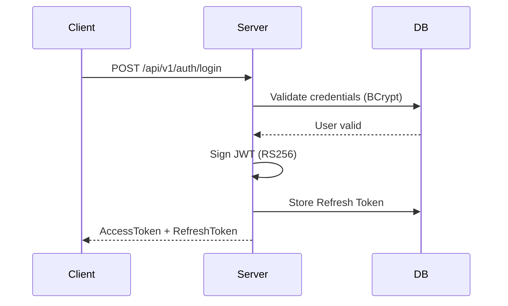
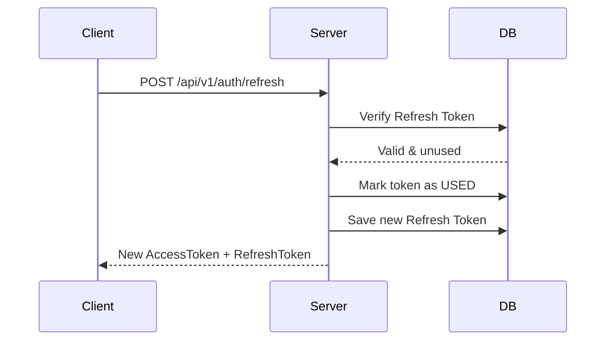

# 🛡️ SecureAuthService
- **SecureAuthService** là một **Auth Service độc lập**, được thiết kế theo hướng **production-ready**, tập trung vào bảo mật, khả năng mở rộng và tính nhất quán khi triển khai.
- Dự án mô phỏng cách một hệ thống backend hiện đại xử lý **JWT, OAuth2 và phân quyền RBAC** trong thực tế.
***
## ✨ Overview
- JWT Authentication sử dụng **RS256 (Asymmetric Key)**
- **One-Time-Use Refresh Token** (Token Rotation)
- **Role-Based Access Control (RBAC)** load quyền từ Database 
- **Google OAuth2 Login** (Auto-register)
- Database versioning với **Flyway (V1 → V5)**
- Đóng gói và triển khai bằng **Docker Compose**
- Kiểm thử API trực tiếp qua **Swagger UI**
---
## 🛠️ Tech Stack & Architecture

| Component | Technology                     | Purpose |
| :--- |:-------------------------------------------| :--- |
| **Core** | Java 17, Spring Boot 3.4.x                | Backend runtime |
| **Security** | Spring Security 6, JWT (RS256) | Authentication & Authorization. |
| **Identity** | Google OAuth2 | Social Login |
| **Database** | PostgreSQL 15   | Persistent storage |
| **Migration** | Flyway      | Schema versioning |
| **DevOps** | Docker & Docker Compose    | Deployment & isolation |
| **API Docs** | SpringDoc OpenAPI     | Swagger UI |
| **DB Tool** | Adminer     | DB inspection |
---
## 🧠 Design Decisions (Tư duy thiết kế)
### Why RS256 instead of HS256?
 * **RS256 (Asymmetric)**
   * Auth Service giữ Private Key  
   * Resource Services chỉ cần Public Key để verify 
   * Phù hợp với kiến trúc microservices
 * **HS256 (Symmetric)**
   * Chia sẻ chung secret
   * Một service bị compromise → toàn hệ thống rủi ro
 ### Why One-Time-Use Refresh Token?
* Ngăn Replay Attack 
* Phát hiện reuse token bất thường 
* Cho phép server-side session revocation
***
## 🔄 Auth Flows
### 1. Login & Token Generation

### 2. Refresh Token Rotation

***
### 📂 Project Structure
````
src/main/java/com/example/secureauthservice
├── config/          # Security, CORS, OpenAPI, Flyway
├── security/        # RSA key loader, JWT filter
├── common/          # BaseEntity, DTOs, exceptions
└── modules/
    ├── auth/        # Login, OAuth2 logic
    ├── user/        # User, Role, Profile
    ├── token/       # Refresh token & rotation
    └── product            # Quản lý Laptop, Brand & Specification Search
        ├── controller     # Chứa các Swagger Annotations (@Operation, @Tag)
        ├── service
        ├── repository     # Specification Search
        └── model          # Entities (Laptop, Brand)
````
### 📦 Module Responsibility

| Module  | Responsibility |
|--------|----------------|
| auth   | Authentication flow, OAuth2 login, token issuing |
| token  | Refresh token lifecycle, rotation & reuse detection |
| user   | User profile, roles, authorities |
| product| Sample business domain (Laptop, Brand) demonstrating secured APIs & Specification Search |
***
## ⚙️ Optional - Start with Docker (Recommended)
Dự án sử dụng port mapping để tránh xung đột với các dịch vụ PostgreSQL hoặc Web server có sẵn trên máy host.
### 🔌 Port Mapping (Host ↔ Container)

| Service        | Container Port | Host Port | Purpose |
|---------------|----------------|-----------|---------|
| Auth API      | 8080           | 8081      | Tránh trùng port local |
| PostgreSQL    | 5432           | 5433      | Không ảnh hưởng DB máy host |
| Adminer       | 8080           | 8082      | DB inspection UI |
### 1. Environment Configuration: 
```
   cp .env.example .env
```
````
# .env.example
POSTGRES_USER=postgres
POSTGRES_PASSWORD=change_me
APP_PORT=8081
DB_PORT=5433
GOOGLE_CLIENT_ID=your_client_id
GOOGLE_CLIENT_SECRET=your_client_secret
````
### 2. Generate RSA Keys (Yêu cầu Git Bash hoặc OpenSSL):
```
mkdir -p secrets
openssl genrsa -out secrets/jwt_private.pem 2048
openssl rsa -in secrets/jwt_private.pem -pubout -out secrets/jwt_public.pem
```
 *⚠️ `secrets/` must not be committed (already in `.gitignore`)*
### 3. Run with Docker Compose
````
   docker compose up --build -d
````
## Access Services
| Service           | URL                                                |
|:------------------|:---------------------------------------------------|
| API               | http://localhost:8081                              |
| Swagger UI        | http://localhost:8081/swagger-ui/index.html        |
| API (JSON)        | http://localhost:8081/v3/api-docs                  |
| Login Auth google | http://localhost:8081/oauth2/authorization/google. |
***
## ⚙️ Optional – Manual Run
* This project is designed to be run with Docker.  
* Manual setup is provided for development or debugging purposes only.
### 1. Requirements:
* **JDK 17+**
* **PostgreSQL 15+**
* **Maven 3.6+**
* **Key RSA**
### 2. Steps:
1. Configure database and OAuth2 credentials in `application.properties`
2. Generate RSA keys under `secrets/`
3. Run:
   ```mvn spring-boot:run```
***

***
## 🛡️ Security Notes
* Private Key không bao giờ commit 
* Password được hash bằng BCrypt 
* Swagger nên tắt trên production 
* Secrets & credentials được quản lý qua .env
---
## 🎯 CV Highlights
* Built SecureAuthService, an enterprise-grade authentication service using RS256 JWT, one-time-use refresh tokens, and RBAC 
* Integrated Google OAuth2, Flyway, and Docker Compose for secure and consistent deployment 
* Implemented server-side token rotation to mitigate replay attacks and enable session revocation
---
